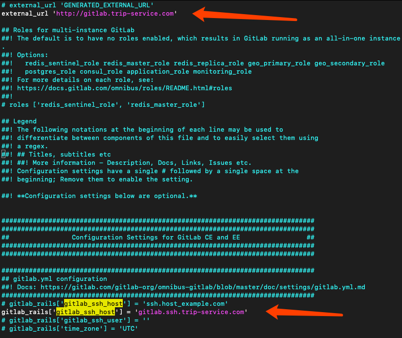
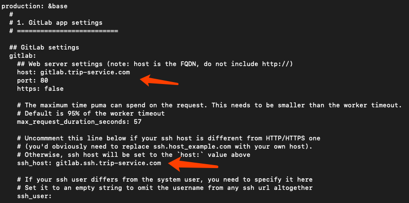
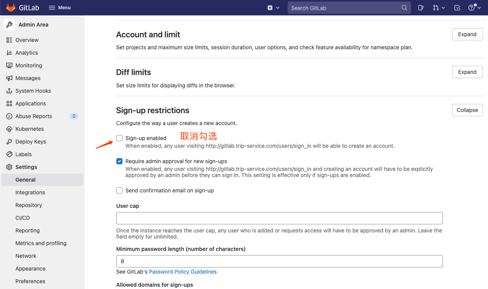

# docker部署gitlab

##  

### 一、前提条件

（1）   存在docker

（2）   服务器可以联网（外网）

（3）   服务器内存至少4G（内存不够会出现502错误）

内存不足502错误如下图所示：


### 二、安装

本次安装在CentOS7下进行，下面的命令建议复制到记事本后再从记事本复制

 1、查找GitLab镜像

```
docker search gitlab
```

 2、拉取gitlab docker镜像 

```
docker pull gitlab/gitlab-ce:latest
```

 3、运行GitLab并运行容器 

```
# 个人认为--hostname可以不加
docker run -itd -m 4096m -p 9980:80 \
 -p 9922:22 \
 -v /root/docker_dir/gitlab/etc:/etc/gitlab  \
 -v /root/docker_dir/gitlab/log:/var/log/gitlab \
 -v /root/docker_dir/gitlab/opt:/var/opt/gitlab \
 --restart always \
 --privileged=true \
 --hostname "gitlab.trip-service.com" \
 --name gitlab-master \
 gitlab/gitlab-ce
```

命令解释：
-i 以交互模式运行容器，通常与 -t 同时使用命令解释：

-t 为容器重新分配一个伪输入终端，通常与 -i 同时使用

-d 后台运行容器，并返回容器ID

-m 4096m 将容器内村上限限制为4Gb

-p 9980:80 将容器内80端口映射至宿主机9980端口，这是访问gitlab的端口

-p 9922:22 将容器内22端口映射至宿主机9922端口，这是访问ssh的端口

-v /usr/local/gitlab-test/etc:/etc/gitlab 将容器/etc/gitlab目录挂载到宿主机/usr/local/gitlab-test/etc目录下，若宿主机内此目录不存在将会自动创建，其他两个挂载同这个一样

--restart always 容器自启动

--privileged=true 让容器获取宿主机root权限

--name gitlab-master 设置容器名称为gitlab-master

gitlab/gitlab-ce 镜像的名称，这里也可以写镜像ID

<font color="red">重点：接下来的配置请在容器内进行修改，不要在挂载到宿主机的文件上进行修改。否则可能出现配置更新不到容器内，或者是不能即时更新到容器内，导致gitlab启动成功，但是无法访问</font>

4、进入容器内

```
docker exec -it gitlab-master /bin/bash
```


5、修改gitlab.rb （先查看下一个步骤再决定是否进行本步骤，本步骤是可以跳过的） 

```
# 打开文件
vi /etc/gitlab/gitlab.rb
 
# 这个文件是全注释掉了的，所以直接在首行添加如下配置
  
# gitlab访问地址，可以写域名。如果端口不写的话默认为80端口 
# 此处端口可以不用改，因为在docker启动的时候已经指定了端口转换
external_url 'http://gitlab.trip-service.com'
# ssh主机ip
gitlab_rails['gitlab_ssh_host'] = 'gitlab.ssh.trip-service.com'
```



<font color="red">注意：1，步骤5修改文件可以直接修改本地挂载的文件。2，上面external_url后面直接接的是域名，是做了nginx反向代理。</font>

6、修改gitlab.yml (这一步原本不是必须的，因为gitlab.rb内配置会覆盖这个，为了防止没有成功覆盖所以我在这里进行配置，当然你也可以选择不修改gitlab.rb直接修改这里)

```
# 打开文件
vi /opt/gitlab/embedded/service/gitlab-rails/config/gitlab.yml
```



```
# 配置解释：
 
# host：访问的IP
# port：访问的端口
# 以上两个和gitlab.rb内external_url的配置保持一致
 
# ssh_host：ssh主机ip，和gitlab.rb内gitlab_rails['gitlab_ssh_host']保持一致

# 保存并退出
:wq
```

7、让修改后的配置生效

```
gitlab-ctl reconfigure
```

8、重启gitlab 

```
gitlab-ctl restart
```

9、退出容器 

```
exit
```

10、在游览器输入如下地址，访问gitlab（eaxternal_url配置的就是这个） 

```
http://gitlab.trip-service.com/
```

如果访问不成功的话： 

（1）   进入容器查看gitlab.rb和gitlab.yml文件是否配置成功

（2）   查看nginx的错误日志

（3）   如果是502，稍微等待一下，看是否能恢复

11、第一次访问默认是root账户，会需要修改密码（密码至少8位数，出现如下界面就基本上部署成功了）。如果没出现这些，则需要在后端重新设置密码。

```
[root@localhost gitlab]# sudo gitlab-rails console production
-------------------------------------------------------------------------------------
 GitLab:       11.7.3 (3424476)
 GitLab Shell: 8.4.4
 postgresql:   9.6.11
-------------------------------------------------------------------------------------
Loading production environment (Rails 5.0.7.1)
```

```
irb(main):001:0> u=User.where(id:1).first
=> #<User id:1 @root>
irb(main):003:0> u.password=12345678
=> 12345678
irb(main):004:0> u.password_confirmation=12345678
=> 12345678
irb(main):005:0> u.save!
Enqueued ActionMailer::DeliveryJob (Job ID: 15c3c8de-e839-4874-8104-d72dbe224756) to Sidekiq(mailers) with arguments: "DeviseMailer", "password_change", "deliver_now", #<GlobalID:0x00007f65d5b944d8 @uri=#<URI::GID gid://gitlab/User/1>>
=> true
irb(main):006:0> quit
```

<font color="yellow">另：gitlab默认用户名密码 root  5ivel!fe</font>

12、安装到此结束

 

### 三、关闭用户注册

1、使用root用户登录gitlab，进入如下图设置页面，取消勾选Sign-up enabled。设置好之后点击Save changes.



 

### 四、自动备份配置

1，在docker的宿主机上加上crontab任务，加上自动备份脚本。

```
#!/bin/sh
# 此脚本将容器内部gitlab备份之后传递至外部mac机器进行存储。以免容器空间不足造成故障
# ****是用户名，192.168.0.10是你的远程ip地址

scp_linux_path='/root/docker_dir/gitlab/opt/backups/'
scp_mac_uri='****@192.168.0.10:/Users/****/Desktop/gitlab_backup'
scp_log_path='/var/log/gitlabscp.log'

time=$(date +%Y-%m-%d\ %H:%M:%S)
docker exec -i gitlab-master gitlab-rake gitlab:backup:create
filename=`ls $scp_linux_path -t |head -n1|awk '{print $0}'`
echo [$time] $scp_linux_path$filename >> $scp_log_path
scp $scp_linux_path$filename $scp_mac_uri

#rm -rf $scp_linux_path$filename
if [[ -z $filename ]];
then
    echo filename is empty.
else
    rm -rf $scp_linux_path$filename
fi
```

2，将上面的脚本文件放入到宿主机，开启crontab任务。`cache_clean.sh` 这个任务是清除缓存，可以不用关注。

 ```
 0 2 * * * /root/script/cache_clean.sh 
 0 8 */3 * * /root/script/gitlab_backup.sh
 ```


参考资料：

1，[docker部署gitlab](https://www.cnblogs.com/diaomina/p/12830449.html)

